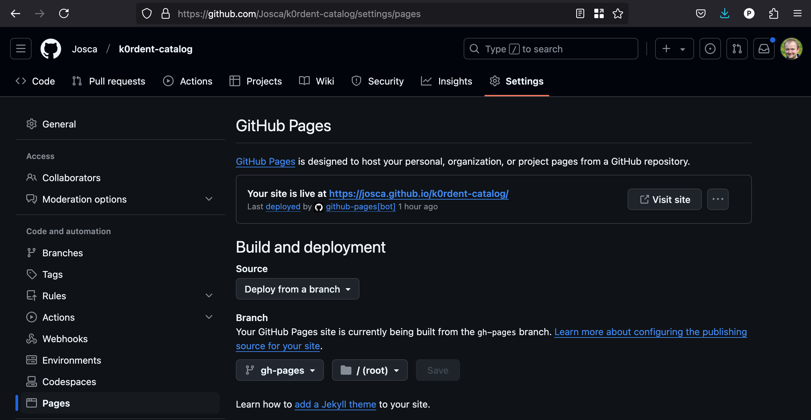

# Development

## Local development
You can easily develop and tests catalog mkdocs pages using mkdocs dev server:
~~~bash
python3 -m venv .venv
source .venv/bin/activate
pip install --upgrade pip
pip install -r mkdocs/requirements.txt
mkdocs serve # start local dev server (automatical changes reflection)
# ...
# INFO    -  [12:24:48] Browser connected: http://127.0.0.1:8000/
~~~

Check local instance of the pages: <http://127.0.0.1:8000/>

## Fork deployment
In fork repositories pages are automatically deployed on each push, you just need to enable github pages in your fork `Settings`:

Then after **each branch push** your updates will be re-deployed to `https://<your-gh-user>.github.io/<your-catalog-fork-name>/`
(e.g. <https://Josca.github.io/k0rdent-catalog>).
